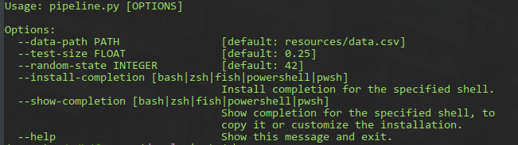
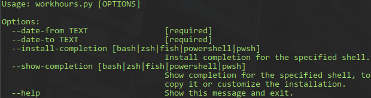

## Bicycle and Workhours test case

Train and evaluation pipeline on Bicycle Dataset and get workhours function

### Installation:

For pipeline solution represented as `typer` command line application. Packages needed can be installed 
via `poetry`: 
```bash
poetry shell
poetry install
```
or `requirements.txt`:
```bash
pip install -e requirements.txt
```

### Usage

#### Pipeline
Command line arguments needed can be viewed with `--help` option:
```bash
python src/pipeline.py --help
```



Run with parameters:
```bash
python src/pipeline.py --data-path 'resources/data.csv' --test-size '0.25'
```

Or just put the `data.csv` in the project root path:
```bash
python src/pipeline.py
```

#### Workhours
Instantiate the difference in workhours by iterating through and check if hour is a workhour.

Help: 
```bash
python src/workhours.py --help
```


Run with parameters: 
```bash
python src/workhours.py --date-from '2019-12-02 08:00:00' --date-to '2019-12-04 12:15:00' 
```
